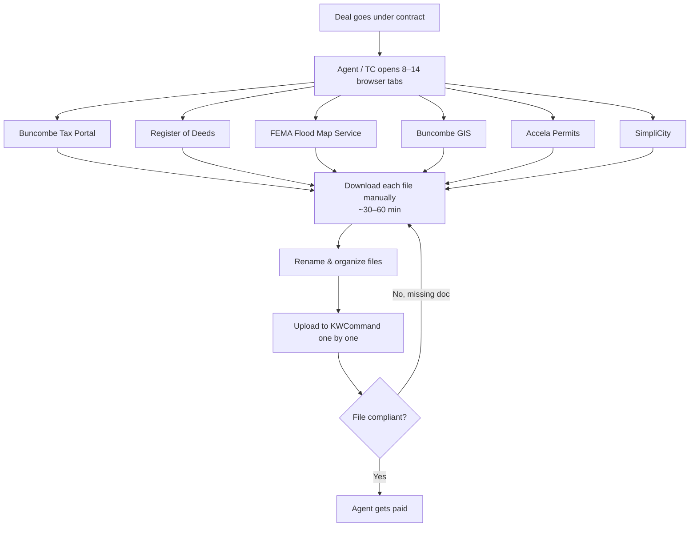
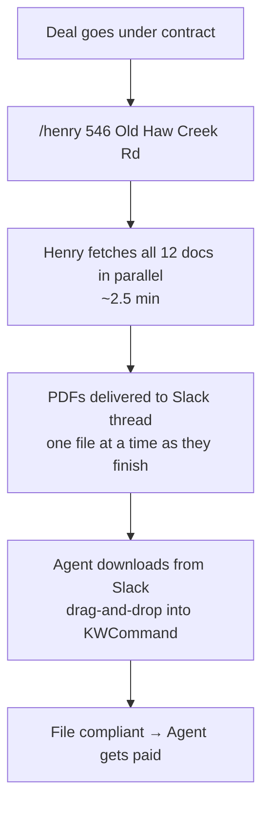
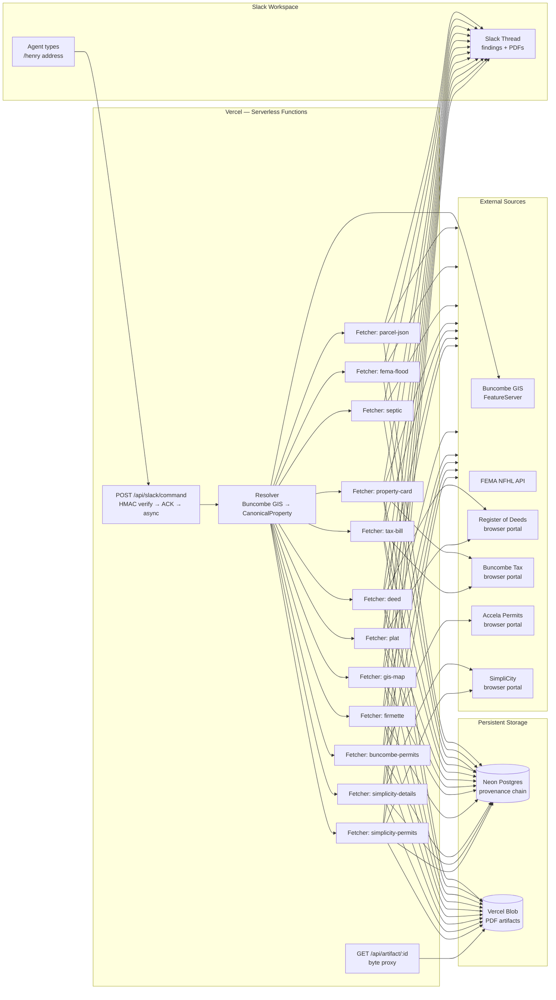
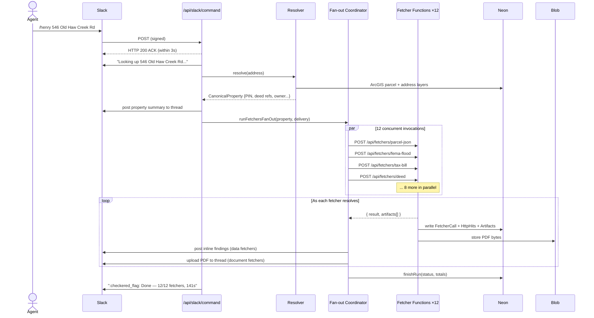
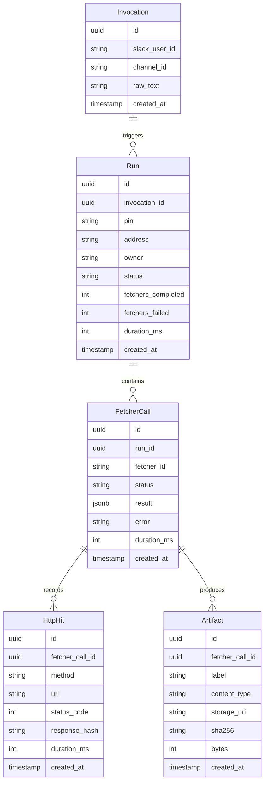

# Henry

> Pull every public-record document for a Buncombe County property in ~2.5 minutes. Delivered to your Slack thread.

---

## The Problem

Every real estate transaction at a Keller Williams market center requires uploading a specific set of public-record documents to KWCommand before the file is compliant — and an agent cannot get paid until the file is compliant.

Those documents are things like the tax bill, the deed, the flood map, the sewer overlay, the permit history. Every one of them is public information. Every one of them lives on a different county or city website. Getting them all means opening 8–14 browser tabs, navigating each portal's own quirks, downloading each file, naming it, and uploading it to KWCommand. An experienced agent or transaction coordinator can do this in 30–60 minutes. An agent without a TC does it themselves.

That's the compliance problem: the documents are the gate between finishing a deal and getting paid.

But the compliance problem is the smaller half of it. Those same documents — the tax bill, the deed, the flood map — contain information that a good agent should be reviewing on every deal regardless of compliance. A flood-zone classification affects insurability. A permit history reveals unpermitted work. A tax value tells you something about the seller's equity position. An agent who actually reads these documents is a better agent. Most agents don't read them because assembling them takes an hour and by that point you just want to upload them and move on.

Henry removes the assembly cost entirely. You type a PIN or address. Henry navigates every portal, downloads every document, and posts each one directly to your Slack thread — along with a plain-English summary of what's in it. Deed arrives in ~40 seconds. Flood map in ~60 seconds. Full package in about 2.5 minutes.

The compliance requirement gets satisfied automatically. And because the documents show up one at a time with a summary, agents actually read them.

---

## The Compliance Workflow

### Before Henry



### After Henry



---

## What Henry Does

```
/henry 546 Old Haw Creek Rd

→ Slack thread fills up over ~2.5 minutes:

  :pushpin: 9648-65-1234-00000
    Owner: JOHN SMITH
    Address: 546 OLD HAW CREEK RD, ASHEVILLE NC 28806
    Deed: Book 6541 / Page 364
    Plat: Book 1234 / Page 56

  :file_folder: Parcel record
    Land value: $87,000
    Total assessed: $312,000
    Acreage: 0.43
    Year built: 1978

  :ocean: FEMA flood zone — X (minimal flood hazard)

  :toilet: Septic / sewer — On septic (1 record)

  [PDF] Property Record Card
  [PDF] Tax Bill
  [PDF] Deed — Book 6541 / Page 364
  [PDF] Plat — Book 1234 / Page 56
  [PDF] GIS Parcel Map
  [PDF] FEMA FIRMette
  [PDF] Buncombe Building Permits
  [PDF] Asheville Permits

  :checkered_flag: Done — 12/12 fetchers, 141s
```

Every PDF is a separate file upload. Each one is ready to download and drag into KWCommand.

---

## The Three Layers of Value

**1. Compliance — the payment gate**
KWCommand requires specific documents per file. Henry generates all of them. Agent or TC uploads them. File closes. Agent gets paid. This is the minimum value proposition and it alone justifies the tool.

**2. Due diligence**
The documents contain information that should inform every deal. Henry surfaces the key findings inline — flood zone, assessed value, septic vs. sewer, permit history — so agents see them without having to read a PDF. An agent who knows their property's flood zone before showing it to a buyer is doing their job better.

**3. Agent protection**
A missed flood-zone flag, an unknown lien, an unpermitted addition — these are the conversations agents do not want to have after an offer goes in. Henry makes it easy to know these things before they matter, not after.

---

## System Architecture



---

## Request Flow (Sequence)



---

## Fan-Out Execution Model

```mermaid
gantt
    title Fetcher execution timeline (approximate)
    dateFormat  s
    axisFormat %Ss

    section Data (REST)
    parcel-json         :done, 0, 5s
    fema-flood          :done, 0, 8s
    septic              :done, 0, 6s

    section Documents (Browser → PDF)
    property-card       :done, 0, 45s
    tax-bill            :done, 0, 40s
    deed                :done, 0, 55s
    plat                :done, 0, 50s
    gis-map             :done, 0, 35s
    firmette            :done, 0, 65s
    buncombe-permits    :done, 0, 90s
    simplicity-details  :done, 0, 80s
    simplicity-permits  :done, 0, 120s
```



Each fetcher runs in an independent Vercel Function with a **300-second budget and isolated Chromium instance**. Wall time equals the slowest fetcher — not the sum. Without parallelism this would take 8–15 minutes sequentially.

---

## Sources (12 Fetchers, Buncombe County)

| Fetcher ID | Document | Source | Method |
|---|---|---|---|
| `parcel-json` | Parcel record + owner | Buncombe ArcGIS FeatureServer | REST |
| `fema-flood` | Flood zone + panel data | FEMA NFHL API | REST |
| `septic` | Septic / sewer status | Buncombe GIS | REST |
| `property-card` | Property Record Card | Spatialest | Browser → PDF |
| `tax-bill` | Tax Bill | Buncombe Tax Portal | Browser → PDF |
| `deed` | Deed | Buncombe Register of Deeds | Browser → PDF |
| `plat` | Plat | Buncombe Register of Deeds | Browser → PDF |
| `gis-map` | GIS Parcel Map | Buncombe GIS | Browser → PDF |
| `firmette` | FEMA FIRMette flood map | FEMA Flood Map Service Center | Browser → PDF |
| `buncombe-permits` | Building Permits | Buncombe Accela | Browser → PDF |
| `simplicity-details` | Asheville Property Details | SimpliCity | Browser → PDF |
| `simplicity-permits` | Asheville Permit History | SimpliCity | Browser → PDF |

Asheville-specific fetchers skip gracefully for properties outside city limits. Deed and Plat skip if no book/page reference is found in the parcel record.

---

## Provenance Chain

Every fact Henry produces is fully traceable. Given any artifact, you can answer: what URL was fetched, at what time, with what response code, by what version of the fetcher, triggered by which Slack user in which channel.



This matters for compliance: you can prove what Henry retrieved, from where, and when. Every run is queryable at `GET /api/runs/:id`.

---

## API Endpoints

| Route | Purpose |
|---|---|
| `POST /api/slack/command` | `/henry` slash command handler |
| `POST /api/slack/events` | `@henry` mention handler |
| `POST /api/fetchers/:id` | Fan-out executor — one per fetcher, internal |
| `GET /api/runs` | List recent runs (auth: HENRY_API_TOKEN) |
| `GET /api/runs/:id` | Full audit trace for a run |
| `GET /api/artifact/:id` | Proxy artifact bytes from Blob store |

---

## Deployment

Henry runs on Vercel. Required environment variables:

```bash
# Slack
SLACK_BOT_TOKEN=xoxb-...
SLACK_SIGNING_SECRET=...

# Database (Neon Postgres)
DATABASE_URL=postgres://...
PROVENANCE_BACKEND=postgres

# Artifact storage (Vercel Blob)
BLOB_READ_WRITE_TOKEN=...
ARTIFACT_BACKEND=vercel-blob

# Routing (enables fan-out + trace links)
PUBLIC_BASE_URL=https://henry-slack.vercel.app

# Optional auth
HENRY_API_TOKEN=...        # Bearer token for /api/runs/*
HENRY_INTERNAL_TOKEN=...   # Header auth on /api/fetchers/*
```

Database schema: `src/provenance/migrations/001_init.sql`

---

## Development History

Henry started as a local CLI tool (`apps/fops/henry`) — TypeScript, Playwright, better-sqlite3, sequential execution, output to a local folder. That version proved the fetchers worked against real Buncombe portals and established the document set needed for KWCommand compliance.

Henry 2 (`henry-slack`, this repo) is the production rewrite:

| | henry (v1) | henry-slack (v2) |
|---|---|---|
| Interface | CLI prompt | Slack slash command |
| Execution | Sequential, one browser at a time | 12 parallel Vercel Functions |
| Storage | SQLite + local files | Neon Postgres + Vercel Blob |
| Delivery | `results/` folder on disk | Slack thread, one file at a time |
| Audit trail | Local SQLite rows | Full provenance chain in Neon |
| Runtime | Local machine | Vercel (serverless, always-on) |
| Wall time | ~3 minutes | ~2.5 minutes |
| Tests | 239 (unit + integration) | 58 (unit + live integration) |

The fetcher logic — the actual browser automation for each portal — carried over directly. The architecture around it was rebuilt from scratch for cloud-native parallel execution and always-on availability.

---

## Local Development

```bash
npm install
npx playwright install chromium

# Resolve an address (no Slack needed)
tsx scripts/resolve.ts "546 Old Haw Creek Rd"

# Run all fetchers locally (no Slack needed)
tsx scripts/fetch.ts "546 Old Haw Creek Rd"
# → writes to ./tmp/runs/<runId>/

# Type check
npx tsc --noEmit

# Tests
npm test
```

Local scripts use in-memory provenance and filesystem artifact storage — no Neon or Blob credentials required.
